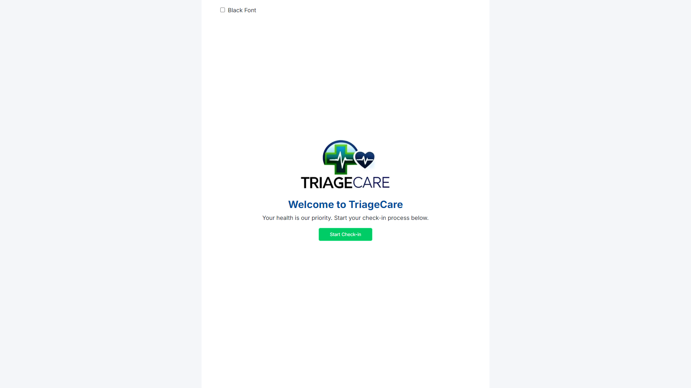
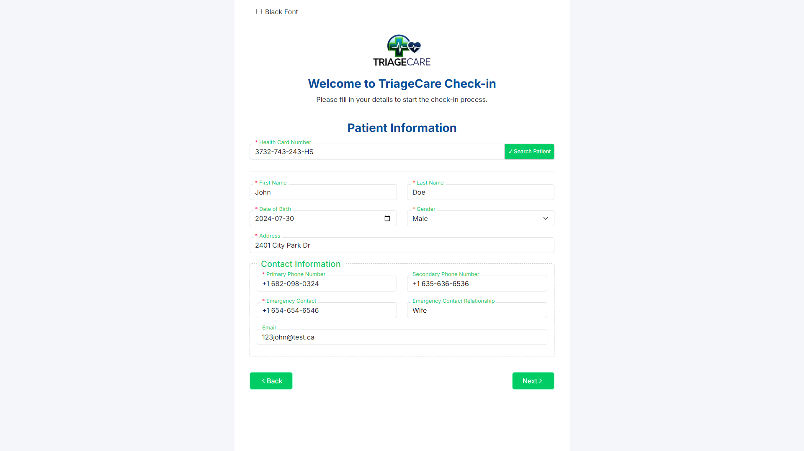
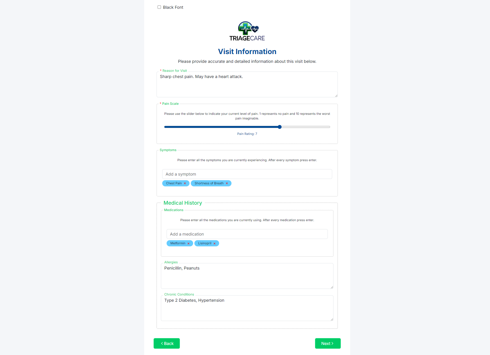
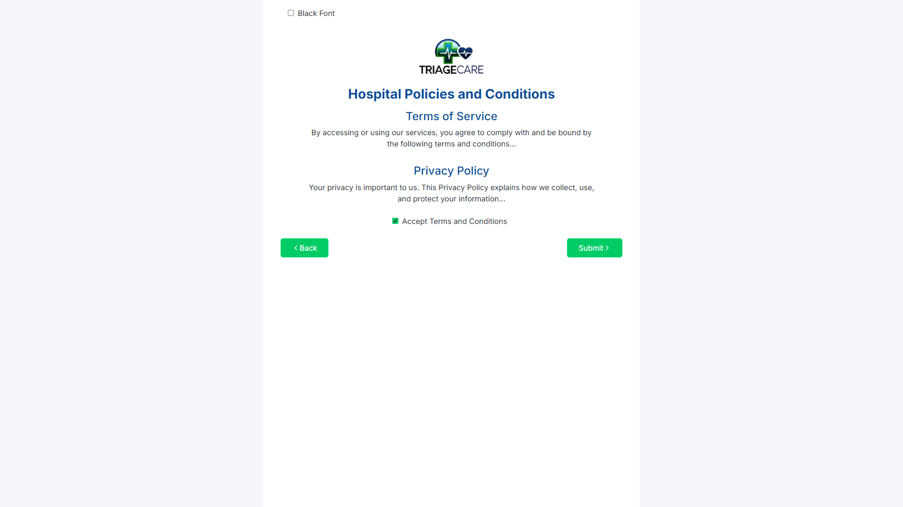
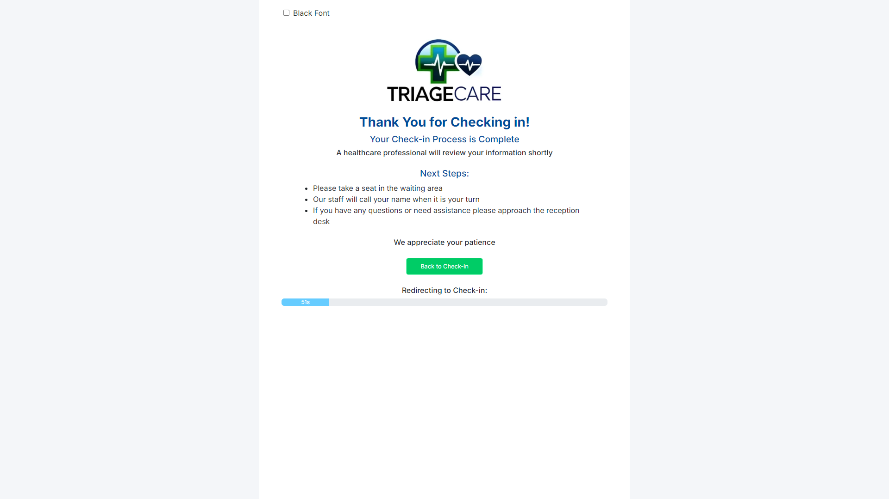

  

# TriageCare

## Table of Contents

- [Overview](#overview)
- [Features](#features)
- [Benefits](#benefits)
- [Screenshots](#screenshots)
- [Technologies Used](#technologies-used)
- [License](#license)

## Overview

TriageCare is a modern hospital triage system designed to streamline the patient check-in process, enhance the efficiency of initial medical assessments, and improve overall patient care. This web application provides an intuitive and user-friendly interface for patients and healthcare providers, ensuring a seamless experience from arrival to consultation.

## Features

- **Patient Check-In**: A simple and efficient check-in process for patients, capturing essential information such as personal details, medical history, and current symptoms.
- **Triage Assessment**: A detailed assessment form for healthcare providers to evaluate the severity of patient symptoms and prioritize care based on urgency.
- **Pain Assessment**: An interactive pain scale slider from 1 to 10, allowing patients to accurately report their pain levels.

## Benefits

- **Efficiency**: Streamlines administrative tasks, reduces paperwork, and minimizes errors by automating data collection and management.
- **Prioritization**: Helps in prioritizing patient care based on the severity of their condition, ensuring that those in most need receive prompt attention.
- **Data Management**: Centralizes patient information, making it easier to access, update, and retrieve, which is crucial for both treatment and administrative purposes.

## Screenshots

**Triage Procedure**

- **Page 1: Triage Start Page**\
  The initial page where patients begin the check-in procedure.

- **Page 2: Patient Information**\
  Patients enter their health card number and click "Search Patient". If the health card number is found, patient information is auto-filled; otherwise, the patient must fill out the form manually. In this demo, the backend will recognize the health card number even if it doesn't exist. After filling in the required fields, the patient can proceed to the next step.

- **Page 3: Visit Information**\
  Patients provide details about their visit and medical history. After filling in the required fields, the patient can click "Next" to continue.
  

- **Page 4: Terms and Conditions**\
  Patients must accept the terms and conditions by checking a box before proceeding. Once accepted, they can move to the next step.

- **Page 5: Check-In Completion**\
  This page provides feedback, thanking the patient for checking in, and outlines any additional steps they need to take. The page will automatically redirect to the start page after a set period of time.

## Technologies Used

- **Frontend**:

  - HTML5
  - CSS3
  - JavaScript (ES6+)
  - React.js (React Vite)
  - React Bootstrap
  - Redux Toolkit

- **Backend**:

  - JavaScript (ES6+)
  - Node.js
  - Express.js
  - SQL

- **Database**:

  - MongoDB
  - PostgreSQL

- **Tools & Utilities**:
  - Git

## License

This project is licensed under the MIT License - see the [LICENSE](LICENSE) file for details.

